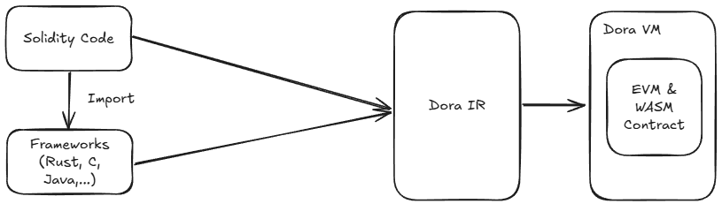

# Interoperability

In Dora, we will provide three ways of interoperability.

## Hybrid Programming

Hybrid programming means that developers can use other advanced projects such as Solidity and Rust simultaneously to organize or manage contract projects, using unified toolchains to enhance seamless interoperability. Just like JVM or .NET, developers can directly use Kotilin to import code written in Java, use Maven to manage projects, use IDE to jump, and intelligent different Kotlin or Java code. Developers do not need to think about cross language FFI or RPC calls, everything is natural because they are all compiled to JVM. We hope that in the Web3 field, developers can enjoy the traversal of the existing ecosystem while enhancing the developer experience through Dora.

## Cross-Contract Interoperability

Because Dora is compatible with EVM, developers can also use CALL, CALLCODE, DELEGATECALL opcodes to call some unknown implementation contract entities across contracts in Dora, achieving complex business logic and data sharing. Compared to hybrid programming, it requires the specific features of EVM, and developers need to understand the deployment address of the contract, which increases development and contract execution costs.

## Cross-Chain Interoperability

In Dora, we plan to achieve seamless communication and asset transfer between different blockchain networks through sidechain technology, cross chain communication protocols, and seamless interoperability within Dora itself, thereby further enhancing the developer experience. At the same time, we will strive to improve modularity and scalability as much as possible, so that different chains can use isomorphic Dora VMs to enhance stability.
