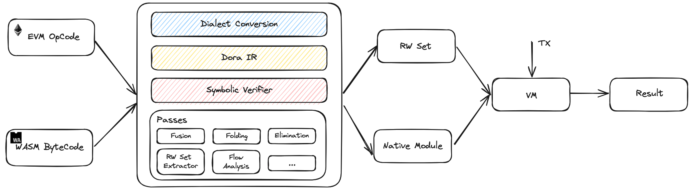

# Technical of Dora

Dora is implemented with a straightforward interface and embedded host, combining modern compilation optimization
techniques with blockchain-specific enhancements to achieve high performance and low fees. For typical contracts,
it can improve performance tenfold compared to existing EVM implementations.

Dora supports both EVM and WASM, allowing interoperability between the two. This dual support enables developers
to benefit from the EVM ecosystem while gaining efficiency improvements and access to existing libraries in
high-level languages like Rust, C++, Go, and Java. The main process of the execution layer is as follows:

## Dialect Conversion

Dialect conversion involves creating a bridge between the Ethereum ecosystem's low-level opcode, WASM bytecode and
the higher-level, more abstract representation used by Dora IR that is a new defined MLIR dialect. Here's the specific
approach to perform this conversion.

- **Conversion Patterns**: Develop patterns that map each EVM opcode and WASM bytecode to its corresponding operation in the Dora IR. This involves creating rewrite patterns that transform EVM and WASM instructions into the abstract operations of MLIR.
- **Type Converter**: Handle the translation of types between the EVM, WASM and MLIR and report or convert illegal types to ensure that the behavior is preserved, such as floating-point type handling in WASM.
- **Control Flow Converter**: Handle the EVM and WASM stack-based control flow into the register-based MLIR control flow.
- **Verifier**: After the conversion, verify the resulting MLIR correctness against the original EVM and WASM instructions to ensure that the behavior is preserved.

## Dora IR

Dora IR is designed based on the LLVM and MLIR frameworks as a register-based intermediate representation. It performs
various optimizations and converts EVM opcodes and WASM bytecode into a unified MLIR dialect named EVM dialect, improving
consistency, correctness, and development efficiency.

Dora IR achieves unified representation across virtual machines mainly through:

- A unified description, definition and operations, complying with EVM specification and semantics, including storage, read, write, event, call ops etc.
- An abstraction layer converts EVM opcodes and WASM bytecode to IR, serving as the intermediary layer to ensure consistent semantics post-conversion. It incorporates data structures compliant with Solidity/EVM and rejects illegal inputs, such as floating-point numbers.

With the EVM specification and semantics supported by Dora IR, Dora enables development on EVM in Solidity as well as other programming languages such as Rust, C++, Go, and Java, ensuring soundness and consistency across them all with a unified compilation foundation.

## Symbolic Verifier

Dora IR is designed to be verification-friendly, with strong type and maximum static determinism. Dora Symbolic Verifier is a symbolic execution engine based on Dora IR. It utilizes abstract interpretation and refinement execution techniques to efficiently explore execution paths and program states. It aims to achieve the following goals:

- **Compilation Integrity**: Ensures logic consistency between the EVM dialect and WASM code, as well as between different optimization passes.
- **Speculative Execution Integrity**: Mitigates security concerns arising from speculative execution complexity by performing formal verification on each speculative rewind to ensure integrity.
- **Verification on User Defined Specification**: Dora Spec is a domain specification language allowing user-defined safety properties that can be verified on Symbolic Verifier such as type safety, memory safety, control flow, and data flow integrity. The verification system of Dora Spec and Symbolic Verifier build an extra layer of security for smart contracts on the Dora network.

## Optimization Passes

Passes are mainly used for Dora IR to complete the following tasks

- **Global Compilation Optimizations**
    
    Optimization passes applied to Dora IR include dead code elimination, which removes code that does not affect the program's output, constant folding, which evaluates expressions with constant values at compile time, function inlining, which replaces a function call with the body of the called function to reduce overhead, opcode fusion, which combines multiple operations into a single step to streamline execution, and register promotion, which involves moving frequently accessed data into CPU registers for faster access.
    These optimizations are crucial for producing the best-optimized machine code, which is essential for extreme performance. The passes takes special care to optimize high-frequency I/O operations as much as possible into memory operations. This transformation reduces the latency associated with I/O by leveraging the speed of memory access.
    Furthermore, the passes optimize memory operations into register operations. This is particularly useful for certain global storage or contract gas cost counters, which are frequently accessed during execution. By optimizing these operations into register operations, the executor can minimize instruction consumption. This not only speeds up execution but also reduces read-write conflicts that can arise from memory access patterns.
    
- **Enhancement of Parallelism**

    Improving parallelism is another significant advantage of these optimizations. By reducing the potential for conflicts and allowing for more concurrent operations, the executor can execute multiple tasks in parallel, further enhancing performance. The read-write set extractor uses static code analysis to accurately locate the read and write positions of storage variables, enabling the executor to parallelize execution resources, minimize resource contention, and ultimately provide peak performance. In addition, speculative execution strategies further enhance the extractor's ability by allowing virtual machines to make informed guesses about the program's execution path. This may involve prefetching data to faster storage layers, such as registers or cache, based on predictions that certain branches of the code may be executed.

## Virtual Machine

Dora IR, after a series of optimizations and compilations, produces native modules that are designed to run efficiently on the virtual machine (VM). When the VM receives a transaction (TX), it loads the corresponding native module for execution. It provides a unified runtime environment for both EVM contracts and WASM contracts, which process typically involves the following steps:

1. **Transaction Reception**: The VM receives transaction requests from the network, which contain information for contract calls or deployments that need to be executed.
2. **Module Loading**: Based on the transaction content, the VM determines which native module needs to be loaded.
3. **Unified Runtime Environment**: Whether it is an Ethereum smart contract or a WASM module, they can be executed efficiently and consistently within the same VM and they can modify block states in a consistent manner, interact with each other, and make cross contract calls.
4. **Execution Optimization**: Since the native modules are optimized for specific platforms, they can fully utilize hardware features during execution, such as instruction set extensions or SIMD, thereby improving execution efficiency.
5. **State Management**: During the execution process, the VM manages the state changes of the contracts, ensuring the consistency and immutability of the state. This includes managing memory, storage, and the call stack.
6. **Security Assurance**: The VM performs necessary security checks to ensure that contract execution does not violate security policies, such as overflow checks, reentrancy protection, etc. Besides, the VM ensure that native modules from different platforms achieve the same execution results through fixed parameters such as memory page size, memory limit, etc
7. **Resource Metering**: Similar to the EVM, executing contracts consumes certain resources (such as computation, storage, etc.), and the VM tracks resource usage to ensure that transactions are completed within resource limits.
8. **Cross-Platform Compatibility**: Due to the design of Dora IR, the generated native modules can run on different operating systems and hardware architectures, enhancing cross-platform compatibility.
9. **Transaction Completion**: Once the contract execution is complete, the VM updates the state according to the execution results and generates a transaction receipt for other participants in the network to verify and record.

In this way, the use of Dora IR and native modules not only improves the execution efficiency of smart contracts but also provides a unified and efficient runtime environment for different types of contracts.
