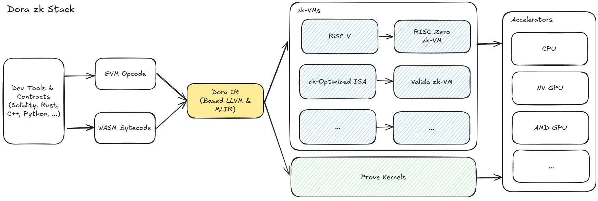

# Dora zk Stack

Dora zk Stack allows developers to seamlessly integrate multiple zk-VM backends using different languages, easily building trustless applications that balance performance, efficiency, modularity, and development productivity. Its main features include

+ **Custom Intermediate Representation (IR)**: Supports both EVM and WASM as well as various zk-VM instruction sets, designed specifically for high-performance computing, providing ultimate performance, accelerating proof generation speed, and reducing computational costs.
+ **Multiple Language Support**: Developers can use their favorite languages, and the interoperability support for EVM and WASM ensures a smooth transition for blockchain developers such as Ethereum.
+ **Prove Kernel Support**: Developers can use Dora to customize VM stacks, write prove kernels to meet specific application requirements and hardware optimizations, without the need to understand underlying stacks such as CUDA or similar technologies on different CPUs and GPUs, as they can be compiled into underlying GPU instructions such as NV PTX using components like Dora IR.
