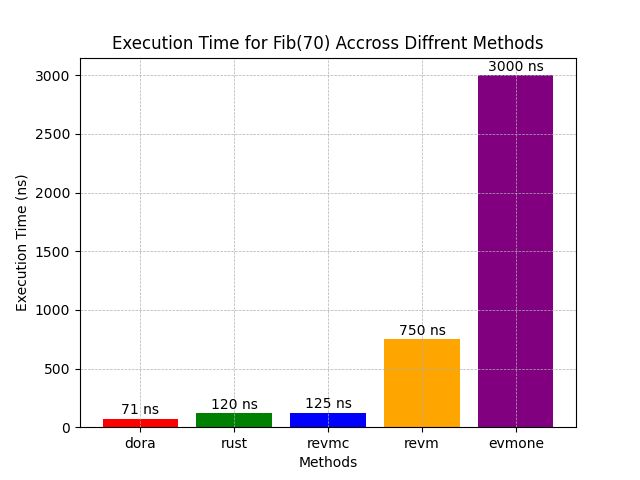
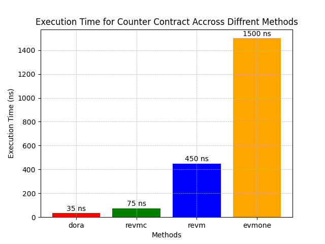
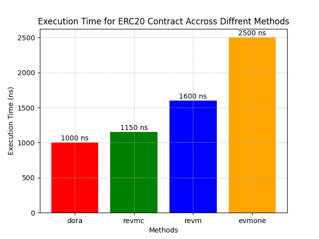
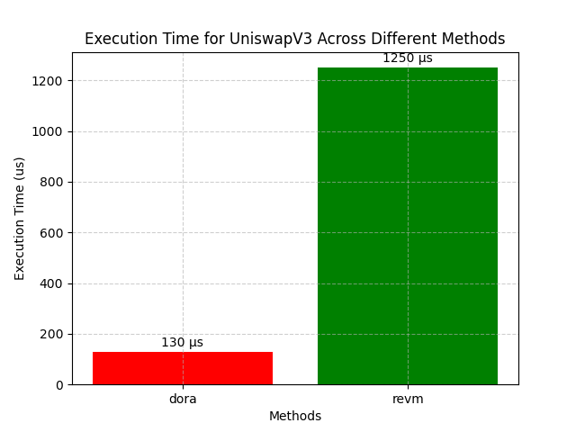

# Benchmarks

You can use the following command to run all benchmarks.

```shell
cargo bench
```

Or you can specify a name to filter the corresponding tests, e.g.,

```shell
cargo bench fibonacci
```

Then you can find the benchmark results at the `target/criterion/` folder in the top level of the repo.

- `Fib(70)`

<p align="center">
  
</p>

- `Counter`

<p align="center">
  
</p>

- `ERC20 Transfer`

<p align="center">
  
</p>

- `Uniswap V3 Swap`

<p align="center">
  
</p>

> Note: When the contract involves Host API or precompile calls, the above results may vary depending on the selection of different Host APIs or precompiles.
